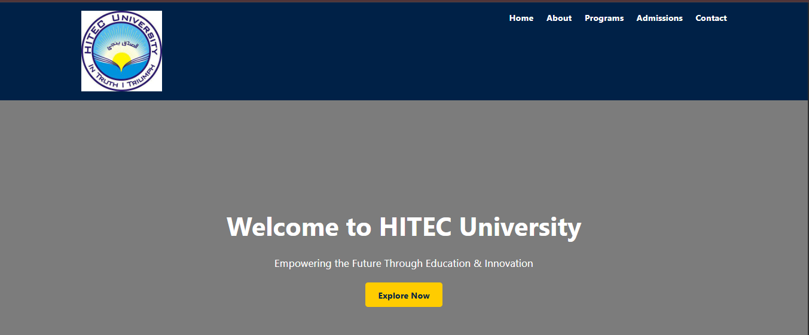
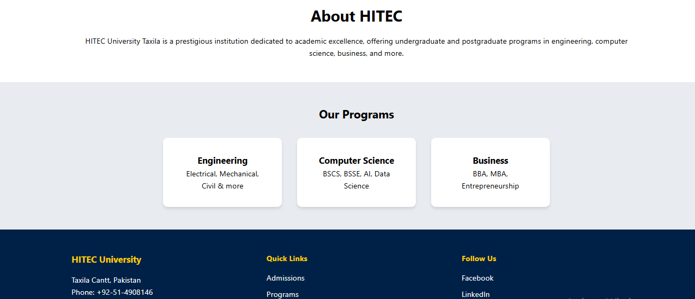

# 🎓 University Landing Page – HITEC University

This is **Day 2** of my 30-day web development challenge.  
The project is a **responsive landing page** for HITEC University, created using **HTML** and **CSS**.

## 📌 Features
- Responsive layout
- Hero section with background image and call-to-action
- About section
- Programs section (cards)
- Multi-column footer (contact, quick links, social links)
- Clean and modern design

## 🛠️ Tech Stack
- HTML5
- CSS3

## 📷 Preview

## 🌐 Live Demo
[View Page on GitHub Pages]
## 📁 Folder Structure
├── index.html
├── style.css
└── README.md
